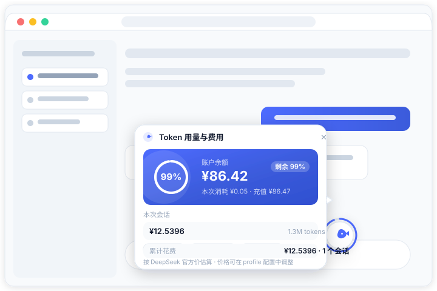

# 🐋 dsh-token-cost

<p align="center">
  <b>DSH（DeepSeek Harness）网页端插件 —— 一只可拖动的 DeepSeek 鲸鱼悬浮球</b><br/>
  随时查看 <b>Token 用量</b>、<b>本次会话 / 累计花费</b> 与 <b>DeepSeek 账号余额</b>
</p>

<p align="center">
  
</p>

> 交互风格参考豆包 / 有道翻译的桌面浮窗：小鲸鱼常驻屏幕角落，点击弹出锚定卡片，可拖动并自动吸附屏幕边缘，安静、不挡事。

---

## ✨ 功能特性

- **🐋 鲸鱼悬浮球**：毛玻璃质感小圆球，hover 时鲸鱼摇摆，外圈环形进度实时显示**剩余余额百分比**
- **🖱️ 豆包式交互**
  - 点击展开 / 收起卡片；点击外部、`Esc`、✕ 或再次点击鲸鱼均可关闭
  - 拖动鲸鱼移动位置，靠近屏幕左右边缘**自动吸附**，位置记忆在浏览器本地
  - 卡片打开时拖动，鲸鱼与卡片**一起移动**，不会被意外关掉
  - 卡片自动在鲸鱼旁空间最大的一侧展开（右 → 左 → 下 → 上），带指向箭头，**任何位置都不会超出屏幕**
- **💳 官方账号余额**：复用 DSH 已配置的 `DEEPSEEK_API_KEY`，调用 DeepSeek 官方 [`GET /user/balance`](https://api-docs.deepseek.com/zh-cn/api/get-user-balance/) 接口，卡片展示总余额、赠送 / 充值构成
- **📊 剩余余额可视化**：以**每次打开 DSH 页面时的余额为基准**，剩余 % = 当前余额 ÷ 基准余额（官方真实计费差额，非估算）；充值后基准自动提升、剩余重置 100%。蓝色（>60%）→ 琥珀（30~60%）→ 红色（<30%），环带同色光晕
- **🧮 服务端精确记账**：注册 `tokenCost` 会话投影单元，逐事件回放会话日志——`request/header` 记录每个请求实际使用的模型，provider 报告的 usage 按**该模型的单价**计费。会话中途切换模型、压缩（compaction）后依然正确；前端不做任何估算
- **📋 用量明细**：本次会话的费用 + 输入 / 缓存读 / 缓存写 / 输出四桶 token 彩色 chip；所有会话的累计花费与按模型拆分
- **🌙 外观**：亮 / 暗主题自适应（DSH 设计 token）、中英双语、数字弹跳动效

## 🏗️ 工作原理

```
┌──────────────────────────── 服务端（node half） ────────────────────────────┐
│  tokenCost 会话投影单元        逐事件 fold：request/header 定模型             │
│                              assistant usage × 该模型单价 → 费用/按模型明细 │
│  /api/token-cost/balance    缓存 60s 的官方余额查询（DEEPSEEK_API_KEY）      │
│  /api/token-cost/prices     生效价格表                                      │
│  /api/token-cost/summary    所有会话（含冷会话）的 tokenCost 聚合            │
└──────────────────────────────────────────────────────────────────────────────┘
                                  │ 投影推送 / HTTP JSON
┌──────────────────────────── 浏览器（browser half） ─────────────────────────┐
│  鲸鱼悬浮球（fixed，独立 React root）                                         │
│  点击切换锚定卡片 · 拖动+边缘吸附（localStorage 记忆）                        │
│  环形进度 = 当前余额 ÷ 本次会话基准余额                                       │
└──────────────────────────────────────────────────────────────────────────────┘
```

**为什么费用是精确的**：会话日志中 `request/header` 事件携带当时的 `(provider, model)`，usage 事件携带 provider 报告的四桶 token 数。服务端在回放时用「该请求实际使用的模型」的单价计价并累计，天然支持会话中途换模型；而不是用「当前模型 × 汇总 token」做客户端估算。

## 📦 安装

### 1. 克隆本项目

```sh
git clone <your-repo-url> dsh-token-cost
```

### 2. 安装进 DSH 的 web profile

```sh
dsh plugin --profile web add file:/path/to/dsh-token-cost
```

> `dsh plugin` 是 pnpm 的转发器：本地 file 依赖离线即可安装。安装完成后插件会自动进入 `dsh.profile.bundles`（识别 `dsh.bundle` 声明）。

### 3. 重启 DSH Web

安装后需重启 `dsh web` 使新的 loader 行与投影单元生效，然后在浏览器刷新页面即可看到右下角的鲸鱼。

### 4. 配置 API Key（余额查询）

余额查询复用 DSH 的 credentials 机制：在 DSH Web 的 **模型设置页**写入 `DEEPSEEK_API_KEY`，或启动 DSH 前 `export DEEPSEEK_API_KEY=sk-...`。不配置也不影响 token 用量与费用显示，仅余额部分显示降级提示。

## ⚙️ 配置

价格表与余额查询均可通过 profile 的 `cordis.patch.yml` 覆盖（价格单位为**元 / 百万 tokens**，按模型 id 匹配，未匹配回落 `default`；`cacheWrite` 按输入价计费，`cacheRead` 按缓存命中价计费）：

```yaml
- id: token-cost
  config:
    prices:
      deepseek-chat:     { input: 2, cacheRead: 0.5, cacheWrite: 2, output: 8 }
      deepseek-reasoner: { input: 4, cacheRead: 1,   cacheWrite: 4, output: 16 }
      deepseek-v4-flash: { input: 1, cacheRead: 0.25, cacheWrite: 1, output: 4 }
      default:           { input: 2, cacheRead: 0.5, cacheWrite: 2, output: 8 }
    balance:
      enabled: true
      apiKeyEnv: DEEPSEEK_API_KEY
      baseUrl: https://api.deepseek.com
      pollMs: 60000
```

## 🖱️ 使用

| 操作 | 效果 |
|---|---|
| 鼠标悬停鲸鱼 | 鲸鱼摇摆，外圈环形显示剩余余额百分比 |
| 点击鲸鱼 | 展开锚定卡片（余额 / 本次会话用量 / 累计花费） |
| 按住拖动 | 移动浮窗；靠近屏幕左右边缘松手自动吸附 |
| 点击卡片外部 / `Esc` / ✕ | 关闭卡片 |
| 卡片打开时拖动鲸鱼 | 卡片跟随移动，保持锚定 |

## 🔌 HTTP 端点（由插件注册在 host）

| 端点 | 说明 |
|---|---|
| `GET /api/token-cost/balance` | 缓存的官方余额快照（60s 轮询） |
| `GET /api/token-cost/prices` | 当前生效的价格表 |
| `GET /api/token-cost/session?id=<sessionId>` | **指定会话**的 tokenCost 投影值（热会话读实时 fold，冷会话读投影缓存），前端浮窗据此显示「本次会话」 |
| `GET /api/token-cost/summary` | 所有会话的 tokenCost 聚合（费用、tokens、按模型） |

## 📂 目录结构

```
├── lib/
│   ├── index.js          # node half：tokenCost 投影单元 + /api/token-cost/* 路由
│   ├── client.js         # browser half：鲸鱼悬浮球（exports["./client"]）
│   └── types/            # TypeScript 声明
├── cordis.patch.yml      # bundle patch：注册 token-cost 行 + 默认配置
├── package.json          # dsh.bundle + dsh.client 双面声明
├── docs/screenshot.svg   # 效果示意图（可替换为真实截图）
├── test/widget.test.mjs  # 浏览器半边回归测试（真实 React 渲染）
└── README.md
```

## 🧪 测试

浏览器半边的回归测试用真实 React 渲染浮窗（React / react-dom 直接取 DSH profile 里已装的那份），覆盖「点击展开卡片」这一路径：

```sh
DSH_HOME=<你的 DSH_HOME> node --test     # 或 npm test
```

| 用例 | 覆盖点 |
|---|---|
| 会话还没有投影值时卡片能正常渲染 | 点击展开不再因 `null` 投影整树崩溃 |
| host 的平铺载荷渲染成数字 | `session` / `summary` 两个端点的载荷形状 |
| rc.6 客户端 store 形状（`projections.faceOf`）被读取 | 前端投影读取 API 的兼容性 |
| 错误边界契约 | 崩溃区域降级为一行提示 |
| 卡片体与浮窗根都被边界包裹 | 任何渲染错误都不会让鲸鱼消失 |

## ❓ FAQ

**余额显示「未配置 API Key」？**
在 DSH Web 的模型设置页填写 `DEEPSEEK_API_KEY`（与 DSH 自身使用的 key 一致），或设置环境变量后重启。

**「剩余 xx%」是怎么算的？**
以每次打开（刷新）DSH 页面后第一次查到的余额为基准：剩余 % = 当前余额 ÷ 基准。本次消耗 = 基准 − 当前余额，是官方接口的真实计费差额。中途充值后基准自动重置为 100%。

**价格不准？**
`cordis.patch.yml` 里的 `prices` 可覆盖任意模型的单价；DeepSeek 官方调价后同步更新即可。

**浮窗挡住了内容？**
拖动它即可；松手时靠近左右边缘会自动吸附贴边。

## 📝 更新日志

### 0.1.1

桌面端（DSH Desktop）稳定性修复 —— **点击鲸鱼后整个浮窗消失**：

- **修复崩溃根因**：卡片只在点击时才挂载，而 `SessionSection` 只挡住了 `undefined`、没挡住 `null`。会话还没有 `tokenCost` 投影值时 `proj` 就是 `null`，读取 `proj.tokens` 抛 `TypeError`，React 随即卸载整个 root —— 于是「点一下浮窗就不见了」。现在 `null` / 非对象一律降级为「—」。
- **投影读取 API 适配**：原先读客户端 store 的 `projectionValues.tokenCost`，该字段在 rc.6 的客户端并不存在（`grep` 命中 0 次），所以「本次会话」永远拿不到值。改为：
  - 主路径 —— 新增 `GET /api/token-cost/session?id=…`，由 host 用 `sessionProjections` 直接给出该会话的投影值（热会话读实时 fold，冷会话读投影缓存）；
  - 备用路径 —— 按 rc.6 的 `session.projections.faceOf("tokenCost").getSnapshot()` 读取（与内置 `dsh-client-ui-permission-presets` / `-goal` 用法一致），并保留对旧 `projectionValues` 形状的兼容。
- **累计花费恢复显示**：`/api/token-cost/summary` 返回的是**平铺**聚合对象，而 `TotalSection` 按 `summary.ok / summary.value` 信封读取，导致该栏永远显示「累计数据不可用」。现在两种形状都接受。
- **双层错误边界**：任何渲染错误只让对应区域降级为一行提示，鲸鱼本体与卡片外壳不再被 React 卸载；即使浮窗整体出错也会退化为一个不消失的兜底按钮，并在控制台打印原始错误。
- **格式化与轮询加固**：`formatTokens` / `formatCost` / `totalTokensOf` 对缺字段、`NaN`、非对象 token 包一律按 0 处理；会话切换时先清空上一会话的载荷，避免串号；会话投影按 5s 轮询刷新。
- 补上 React 18.3 的 `key` 传参写法（`jsx(type, props, key)`），并为主新增的子元素补齐 `key`。

## 📄 License

[MIT](LICENSE)
